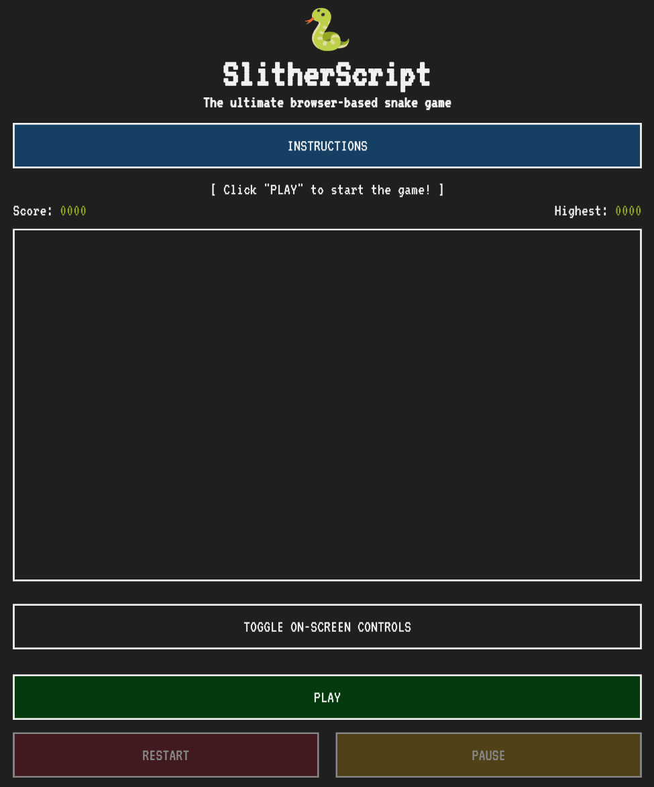

# 🐍 SlitherScript
The official GitHub repository for SlitherScript, a simple yet fun snake game built with plain HTML, CSS, and JavaScript. Give it a play and have some fun!

## 📃 Description
SlitherScript is a snake game in which you control a snake with the goal of eating food which spawns randomly across the game board. Each food you eat grows both your snake's size and current score. If you reach 1000 points without running into any walls or yourself, you win!

## 🔍 Background Information
I am creating this project as part of my studies at General Assembly's software engineering bootcamp.

The reason I chose to create a snake game as my project is simply because I found the idea to be incredibly fun and intriguing for a beginner's game project, while at the same time allowing for the oppurtunity to learn much of JavaScript's fundamentals along with CSS Grid which I believe will be valuable knowledge for me in the future.

## 🚀 Getting Started
**Play it here:** [https://smhatc.github.io/SlitherScript](https://smhatc.github.io/SlitherScript).

**Planning materials:** [https://trello.com/b/LDrh7lRE/slitherscript](https://trello.com/b/LDrh7lRE/slitherscript).

**Game Instructions:**
1. Click the "PLAY" button.
2. Use the on-screen controls or any of the four arrow keys on your keyboard to control the snake's movement.
3. Move over (eat) the food that spawns to grow your snake and score.
4. Avoid running into any walls or yourself.
5. Click the "PAUSE" button to stop the game in case you need to take a break.
6. Once you reach 1000 points, you've won!
7. Click the "RESTART" button to play again.

## 💻 Technologies Used
- HTML.
- CSS.
- JavaScript.

## 📚 Attributions
- Google Fonts for the game font (VT323). Check it out!

## 🤔 Next Steps
- Add special food which awards more points than regular food.
- Make it so that food which spawns in difficult positions (e.g. near walls or snake) awards more points.
- Allow players to save their progress locally beyond the current browser tab session.
- Add other kinds of progressive difficulty increase mechanics than simply increasing the speed.
- Add a game currency of some kind which allows players to purchase customizations for their snake (e.g. custom colors).